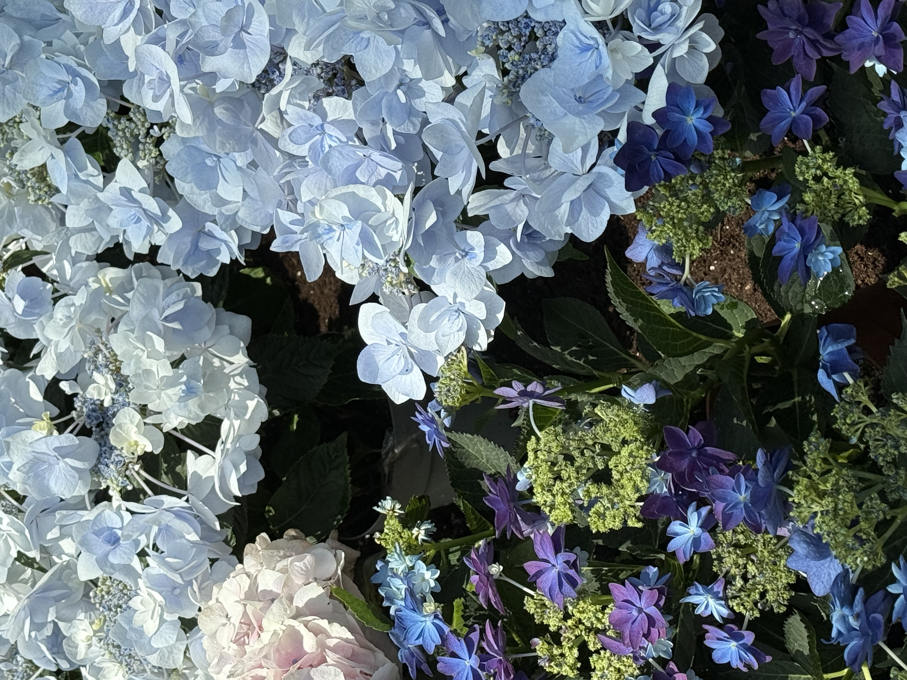

 
  

    <samp>
      24/7  
       
       
      langs: ts, vue, react, c++, r, sql, k8s  
      tools: figma, affinity, davinci, touchdesigner
       
       
      projects: <a href="https://storeplayer.cloud/devices">storeplayer</a>, <a href="https://devaelectronics.com/">deva electronics</a>, <a href="https://mpxoverip.com/">mpx</a>
       
       
       
      website is on the way
       
       
      <b>
    </samp>
     
     
    
  

